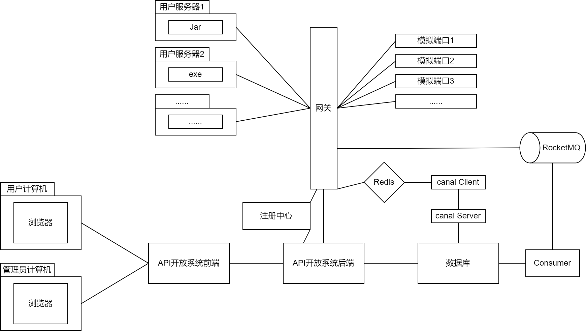

项目组件介绍：

项目运行需要：
1. 开启mysql
2. 开启redis
3. 开启canal
4. 开启nacos
5. 开启RocketMQ
6. 开启5个微服务，以正常测试
   1. 后端：[后端仓库](https://github.com/shoumingchilun/API_OPEN_SPACE_BACKEND)
   2. 网关：[网关仓库](https://github.com/shoumingchilun/API_OPEN_SPACE_GATEWAY)
   3. Canal Client：[Canal Client仓库](https://github.com/shoumingchilun/API_OPEN_SPACE_CANAL)
   4. 模拟接口（不开启也行，注册接口的时候随便设置个网址就行，模拟接口可用于查看网关发送请求的相关信息）：
      1. [模拟接口_时间接口](https://github.com/shoumingchilun/TimeInterface)
      2. [模拟接口_ip接口](https://github.com/shoumingchilun/IPInterface)
   5. 接口调用端：请自行搭建。
      1. 相关Starter：[客户端SDK仓库](https://github.com/shoumingchilun/API_OPEN_SPACE_STARTER)

使用流程：
1. 注册
2. 登录
3. 使用接口信息管理控制器发布接口
4. 使用路由管理控制器刷新路由
5. 使用接口访问管理控制器申请对应接口
6. 调用Starter发送请求至http://网关域名/api/接口id

项目简介：
基于Spring Boot+Gateway+Redis+RocketMQ的接口托管平台。
用户可以：
1. 发布接口并设置收费策略（支持固定计费、每次调用单独计费或按时间窗口计费）、访问限制策略（RPS）。
2. 监控接口被调用情况，并查看异常信息日志。
3. 通过客户端SDK轻松调用其他用户发布的接口。

项目亮点：
1. 使用Swagger+knife4j生成OpenAPI规范的接口文档
2. 使用Mybatis-X插件，根据数据表快速生成实体类、DAO和服务层。
3. 使用Nacos进行服务注册、服务发现。
4. 使用RouteDefinitionWriter+适配器模式+RPC实现动态路由，并支持服务端远程控制路由规则。
5. 设计 API 签名认证算法，用户需申请ak/sk并生成签名进行接口调用，保障调用的安全性、可溯源性（支持异常日志、扣费记录等功能）。
6. 开发客户端SDK（Springboot Starter），方便用户快捷调用端口、生成签名，一行代码即可访问接口。
7. 使用公钥私钥生成数字签名，接口提供者可通过SDK快速校验请求是否来源于网关转发。
8. 引入Redis实现防重放，同时存储accesskey相关信息，减少请求到达网关时数据库的读压力。
9. 引入RocketMQ，持久化日志/消费消息和异常消息，并通过批量异步写入减少数据库的写压力。
10. 引入canal，透明地实现了最终一致性。
11. 通过装饰模式重写Spring Gateway(WebFlux)中解析请求、响应的方法，在异常情况下记录请求体、响应体充当日志。

项目难点：
1. 网关：
   1. 动态路由实现：RouteDefinitionWriter没有相关文档说明，只能看别人的项目和框架源码来实现相关功能。
   2. 异常日志实现：不熟悉Reactor编程，响应式获得请求体和响应体很麻烦。
2. 服务端：
   1. 访问限制实现：访问限制模块的添加导致需要修改底层模块：
      1. 网关方面，需提供新远程调用接口以修改访问限制相关过滤器。（通过给DTO加属性实现）
      2. 后端方面，当时远程调用接口已经封装好了，并进一步封装好了路由服务层，需要重写路由服务层以保证接口信息的增删改查与接口访问限制的增删改查不会相互影响以导致网关路由规则存在问题（比如修改接口的URI后，会调用路由服务层的更新路由方法，该路由方法在网关层会重置该接口的路由信息，进而导致路由的访问限制失效，需要重写路由服务层的更新路由方法）；同时还有一个问题，之前有一个类的解耦合没做好，该类同时是接口信息service类（提供接口信息的增删改查服务）的装饰类（保证在接口信息进行增删改查时数据同步到网关），同时又是远程调用过程和路由服务接口的实现类（实现了路由的增删改查/刷新操作），导致实现访问限制的过程中需要梳理好各个类之间的关系才能继续进行。
   2. 计费策略实现：在计费策略的实现过程中，开始只设计了单次调用固定计费和单次调用动态计费的模式，没有想的还有时间窗口的计费模式，需要给accesskey添加过期时间类实现，导致修改工程量比较大。
      
项目意义：
1. 提供接口托管服务：对于企业或开发者来说，提供了一个方便的接口托管平台，使他们能够快速发布、管理和收费他们的接口服务，而不必花费大量时间和资源构建自己的基础设施。 
2. 安全保障：项目引入了API签名认证算法、公钥私钥生成数字签名等安全机制，确保接口调用的安全性和可溯源性，为用户和接口提供者提供了一定的安全保障。 
3. 性能优化：通过引入Redis、RocketMQ等技术，实现了防重放、减少数据库读写压力、异步写入等功能，从而提高了系统的性能和吞吐量。 
4. 提供监控和日志功能：用户可以监控接口调用情况，查看异常信息日志，这对于及时发现和解决问题、提升系统稳定性和可用性非常重要。 
5. 技术实践与创新：项目中引入了诸多技术，如Spring Boot、Gateway、Redis、RocketMQ等，并结合了Swagger、knife4j、Mybatis-X等工具，同时采用了装饰模式、适配器模式等设计模式，这既是对技术的实践，也是对技术创新的探索。 
6. 提升开发者体验：开发了客户端SDK，方便用户快速调用接口，减少了用户的开发成本和学习成本，提升了开发者的使用体验。

